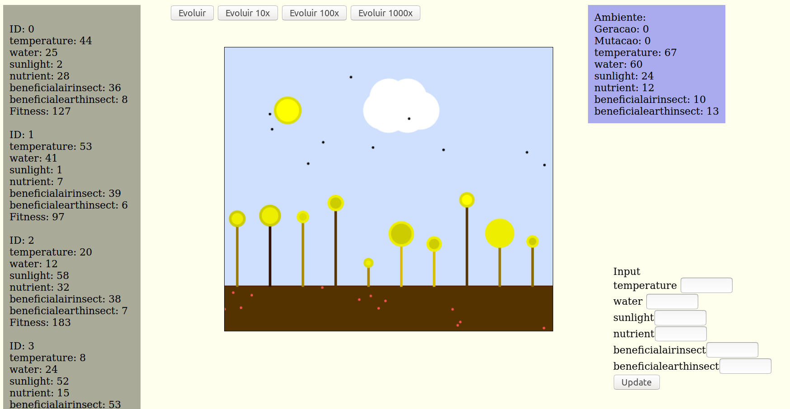

# General

This code is based on Genetic Algorithm proposed in [Ai Game for Developers](http://shop.oreilly.com/product/9780596005559.do) where code is made in C++, this version is made in JavaScript and this is not using any library only Canvas from HTML5. You doesn't need local server for run this sample.

This version has some elements in portuguese (my native language), I would like to translate to english when I has time :stuck_out_tongue_winking_eye:, but if you dont speak portuguese, keep calm I guess which you can understand, too.

You can see this code is running [here](https://tushn.github.io/Genetic-Agorithm-Flowers-Example-JS/AI_World.html).

# Explained

Details of programming are exposed in above book, but this important is listing variables below:

- temperature:
- water:
- sunlight:
- nutrient:
- beneficialairinsect:
- beneficialairinsect
<!--

-->

<!-- {:height="36px" width="36px"} -->

# TODO:

I wish to add in project:  

- [ ] To finish this README
- [ ] To rename variables and buttons for english
- [ ] To present a "perfect flower" for environment in another canvas
- [ ] To improve HUD, many elements to improvment:
    - [ ] Sliders for values
    - [ ] Values variables
    - [ ] Colors and design
- [ ] Draw or change specific flowers directly
- [ ] Change number of flowers in interface

